# Self-Distilled Internet Photos (SDIP) Dataset

<html>
<head>
</head>
<body>
<table>
 <tr>
  <th colspan=4>Self-Distilled Flickr (SD-Flickr)</th>
  <th></th>
  <th colspan=4>Self-Distilled LSUN (SD-LSUN)</th>
 </tr>
 <tr>
  <td align="center" colspan=4>SD-Dogs</td>
  <td></td>
  <td align="center" colspan=4>SD-Bicycles</td>
 </tr>  
 <tr>
  
  <td><a href="https://live.staticflickr.com/7246/7577844002_5b6efb8bff_o.jpg"> 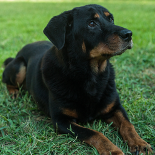</a></td>
  <td><a href="https://live.staticflickr.com/4631/28044168389_0137ca1358_o.jpg"> 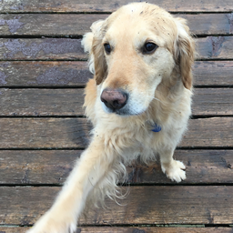</a></td>
  <td><a href="https://live.staticflickr.com/137/405472129_8a2ab90f1f_o.jpg"> 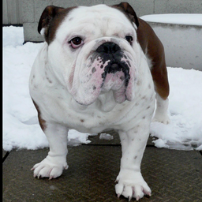</a></td>
  <td><a href="https://live.staticflickr.com/23/31916302_5a4e589f47_o.jpg"> 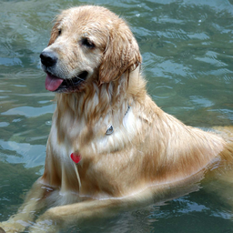</a></td>
  <td></td>
  <td> 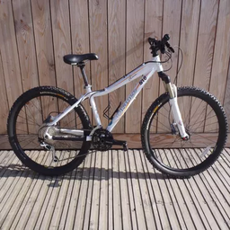</td>
  <td> 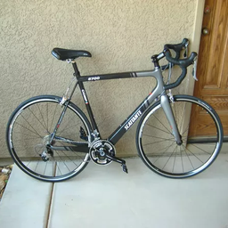</td>
  <td> 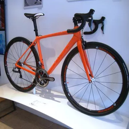</td>
  <td> 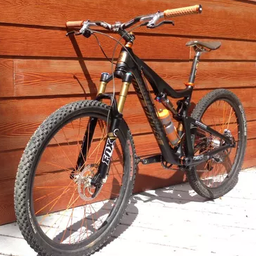</td>
 </tr>
 <tr>
  <td> <a href="https://live.staticflickr.com/4757/28288998479_294326de12_o.jpg" > </a> </td>
  <td> <a href="https://live.staticflickr.com/65535/49298856731_a5415d8c3f_o.jpg" > 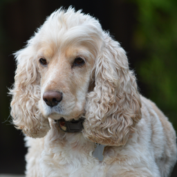</a> </td>
  <td> <a href="https://live.staticflickr.com/8876/17380389632_ee5576fe3c_o.jpg" > 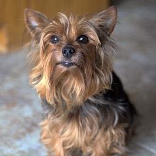</a> </td>
  <td> <a href="https://live.staticflickr.com/6/11041464_348c7431d2_o.jpg" > 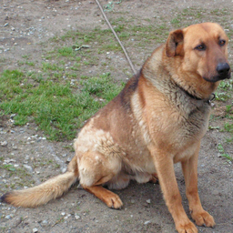</a> </td>
  <td></td>
  <td> 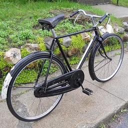</td>
  <td> 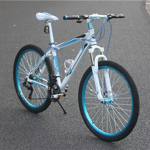</td>
  <td> 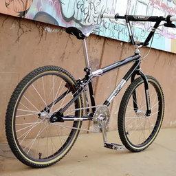</td>
  <td> 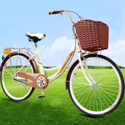</td>
 </tr>
 <tr>
  <td align="center" colspan=4>SD-Elephants</td>
  <td></td>
  <td align="center" colspan=4>SD-Horses</td>
 </tr>  
 <tr>
  <td><a href="https://live.staticflickr.com/4593/39192453802_a6007b4939_o.jpg"> 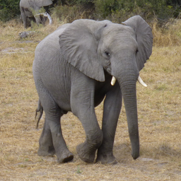</a></td>
  <td><a href="https://live.staticflickr.com/8581/28948628046_35425be673_o.jpg"> 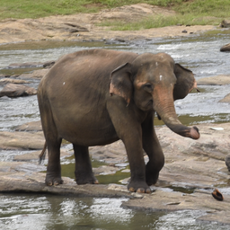</a></td>
  <td><a href="https://live.staticflickr.com/8365/8514867856_5bf0b9abe3_o.jpg"> </a></td>
  <td><a href="https://live.staticflickr.com/8505/28588852913_c12ca5b51f_o.jpg"> 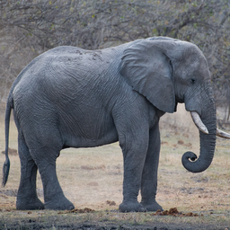</a></td>
  <td></td>
  <td> 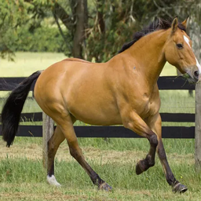</td>
  <td> 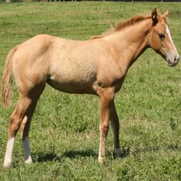</td>
  <td> 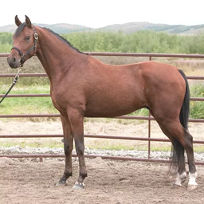</td>
  <td> 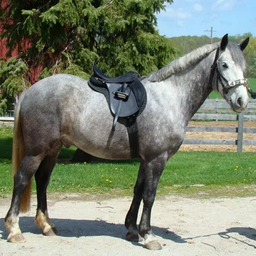</td>
 </tr>
 <tr>
  <td><a href="https://live.staticflickr.com/1365/1196142985_2a852c7361_o.jpg" width=128> 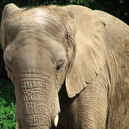</a></td>
  <td><a href="https://live.staticflickr.com/5147/5577309680_46ae634613_o.jpg" width=128> 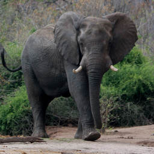</a></td> 
  <td><a href="https://live.staticflickr.com/7825/40354251633_64e965bc3a_o.jpg" width=128> 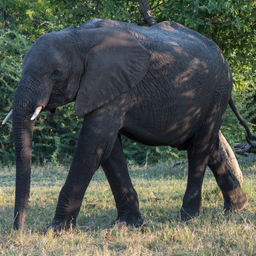</a></td>
  <td><a href="https://live.staticflickr.com/804/27564739788_e6df54ac4e_o.jpg" width=128> 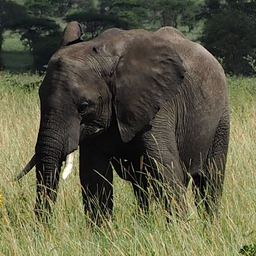</a></td>
  <td></td>
  <td> 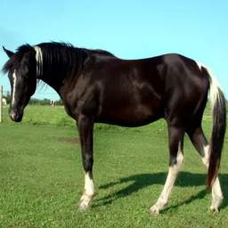</td>
  <td> 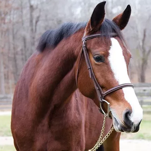</td>
  <td> 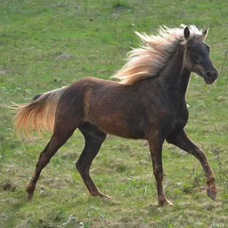</td>
  <td> 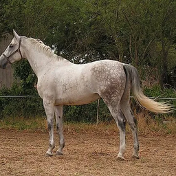</td>
 </tr>
</table>
 </body>
</html>

*Self-Distilled Internet Photos (SDIP)* is a multi-domain image dataset. The dataset consists of *Self-Distilled Flickr (SD-Flickr)* and *Self-Distilled LSUN (SD-LSUN)* that were crawled from [Flickr](https://www.flickr.com/) and [LSUN dataset](https://www.yf.io/p/lsun), respectively, and then curated using the method described in our Self-Distilled StyleGAN paper:

> **Self-Distilled StyleGAN: Towards Generation from Internet Photos**<br>
> Ron Mokady, Michal Yarom, Omer Tov, Oran Lang, Daniel Cohen-Or, Tali Dekel, Michal Irani, Inbar Mosseri
https://arxiv.org/abs/2202.12211

## Overview

[StyleGAN’s](https://github.com/NVlabs/stylegan2-ada-pytorch) fascinating generative and editing abilities are limited to structurally aligned and well-curated datasets. It does not work well on raw datasets downloaded from the Internet. The SDIP domains presented here, which are StyleGAN-friendly, were automatically curated by our [method](https://arxiv.org/abs/2202.12211) from raw images collected from the Internet. The raw uncurated images in *Self-Distilled Flicker (SD-Flickr)* were first crawled from [Flickr](https://www.flickr.com/) using a simple keyword (e.g. 'dog' or 'elephant').

The dataset in this page exhibits 4 domains: SD-Dogs (126K images), SD-Elephants (39K images), SD-Bicycles (96K images), and SD-Horses (162K images). Our curation process consists of a simple pre-processing step (off-the-shelf object detector to crop the main object and then rescale), followed by a sophisticated StyleGAN-friendly filtering step (which removes outlier images while maintaining dataset diversity). This results in a more coherent and clean dataset, which is suitable for training a StyleGAN2 generator (see more details in our [paper](https://arxiv.org/abs/2202.12211)).

The data itself is saved in a json format: for SD-Flickr we provide urls of the original images and bounding boxes used for cropping; for SD-LSUN we provide image identifiers with the bounding boxes. In addition to the SDIP dataset, we also provide weights of pre-trained StyleGAN2 models trained using each image domain provided here. 

### Download

Script is coming up soon.


## Self-Distilled Flickr (SD-Flickr)

### Image Domains 

We provide high-quality image collections for two domains curated from [Flickr](https://www.flickr.com/): 'Dogs' and 'Elephants'. 
Each image in SD-Flickr is given by a URL to the original image and a bounding box that indicates the crop we performed to obtain StyleGAN training data.

| Domain Name | File | #Images | Description
| :---------- | :--- | :--: |  :----------
| SD-Dogs | &boxvr;&nbsp; [dogs.json](./datasets/dogs.json) | 126K | Metadata for *SD-Dogs* including URLs and object bounding boxes.
| SD-Elephants | &boxvr;&nbsp; [elephants.json](./datasets/elephants.json) | 39K | Metadata for *SD-Elephants* including URLs and object bounding boxes.

### Pre-trained StyleGAN2 models

Coming up soon!

## Self-Distilled LSUN (SD-LSUN)

### Image Domains 

We provide image collections for two [LSUN](https://www.yf.io/p/lsun) domains: 'Horses' and 'Bicycles'. Each image in SD-LSUN is given by the image name, as appears in the LSUN dataset, and a bounding box that indicates the crop we performed to obtain StyleGAN training data. The LSUN images can be downloaded from [here](http://dl.yf.io/lsun/objects/).

| Domain Name | File | #Images | Description
| :---------- | :--- | :--: |  :----------
| SD-Horses | &boxvr;&nbsp; [horses.json](./datasets/horses.json) | 162K | Metadata for SD-Horse including the names of the filtered images and object bounding boxes.
| SD-Bicycles | &boxvr;&nbsp; [bicycles.json](./datasets/bicycles.json) | 96K | Metadata for SD-Bicycles including the names of the filtered images and object bounding boxes.


### Pre-trained StyleGAN2 models

Coming up soon! 

## Citation
If you plan to use this dataset, or the published code, please cite it as:
```
@misc{mokady2022selfdistilled,
      title={Self-Distilled StyleGAN: Towards Generation from Internet Photos}, 
      author={Ron Mokady and Michal Yarom and Omer Tov and Oran Lang and Daniel Cohen-Or and Tali Dekel and Michal Irani and Inbar Mosseri},
      year={2022},
      eprint={2202.12211},
      archivePrefix={arXiv},
      primaryClass={cs.CV}
}
```

If you are using LSUN images, please also follow the citation instructions on the [LSUN website](https://www.yf.io/p/lsun). 

## Licenses

The individual images were published in Flickr by their respective authors under either [Creative Commons BY 2.0](https://creativecommons.org/licenses/by/2.0/), [Public Domain Mark 1.0](https://creativecommons.org/publicdomain/mark/1.0/), or [Public Domain CC0 1.0](https://creativecommons.org/publicdomain/zero/1.0/). All of these licenses allow **free use, redistribution, and adaptation**. However, some of them require giving **appropriate credit** to the original author, as well as **indicating any changes** that were made to the images.

* [https://creativecommons.org/licenses/by/2.0/](https://creativecommons.org/licenses/by/2.0/)
* [https://creativecommons.org/publicdomain/mark/1.0/](https://creativecommons.org/publicdomain/mark/1.0/)
* [https://creativecommons.org/publicdomain/zero/1.0/](https://creativecommons.org/publicdomain/zero/1.0/)

The datasets (including JSON metadata and documentation) and pre-trained models are made available under [CC-BY-4.0](https://creativecommons.org/licenses/by/4.0/). If you use the data or models, please give appropriate credit by citing our paper.

## Privacy

When collecting the data, we were careful to only include photos that &ndash; to the best of our knowledge &ndash; were intended for free use and redistribution by their respective authors. That said, we are committed to protecting the privacy of individuals who do not wish their photos to be included. To get your photo removed from Contact [self-distilled-stylegan@google.com](mailto:self-distilled-stylegan@google.com). Please include the image URL in the mail.
